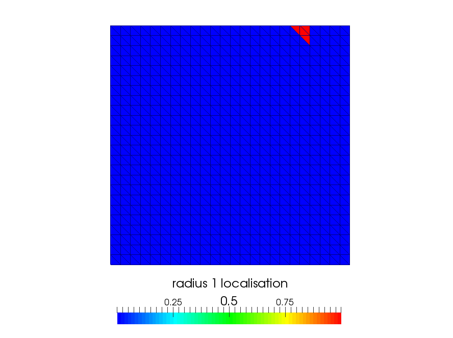
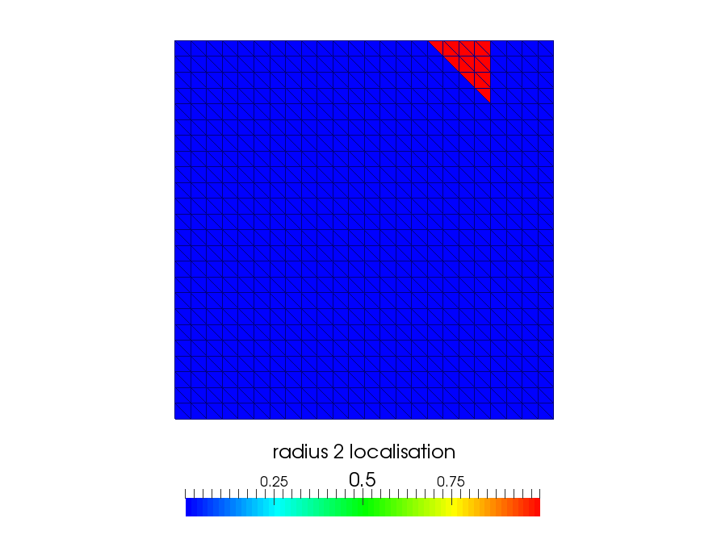

.. _localisation:

Localisation
============

Localisation is used commonly in filtering, especially in the Ensemble Kalman Filter (Anderson, 2012),
however it has also been trialed in many different settings in particle filters, and in particular the
type of particle filter used in this package (Cheng and Reich, 2013).

In this package it is the process of localising the importance weight update and the ensemble
transform algorithm around a certain radius of neighbouring points / components to a local one in
a multidimensional ensemble forecast. This localisation is needed to prevent the degeneracy of
weights and to simplify the linear programming problem in the ensemble transform algorithm (see Reich, 2011 for details).
As we work with functions in FADE, this localisation is done via radii of neighbouring cells on
a mesh that these function are discretized on.

Thankfully Firedrake has a built-in multigrid framework and this helps with localisation. Consider we
have an ensemble of functions on the function space :math:`V_{l}` that is living on a mesh
:math:`M_{l}`. Now suppose this mesh is part of a refined hierarchy of meshes

.. math:: M_{L} \subset M_{L-1} \subset \dots M_{l} \subset \dots M_{0}.

In Firedrake this is specfied via

.. code::
    
    mesh_hierarchy = MeshHierarchy(mesh, L)

where `mesh` is the coarsest mesh in the hierarchy and `L` is the number of refined levels from that
mesh. Then in Firedrake one can project functions (:math:`f`) on :math:`V_{l}` on to
:math:`V_{q}` (to make the functions :math:`g`), which live on different levels of the hierarchy of meshes, via

.. code::
    
    prolong(f, g)

if :math:`q>l` or via

.. code::
    
   inject(f, g)

if :math:`q<l`. This helps with localisation in FADE as we can use the coarsening of functions,
which involves aggregating finer mesh subcells of a coarse cell together, as a way of localising a
function around neighbourhoods (coarse subcells) of local cells (finer subcells). To use this type
of localisation, the function space that the ensemble functions exist on have to be living on a mesh
that is a part of a hierarchy with coarser levels below itself. If we want to localise each finer
cell of a mesh on level `l` around a coarse cell on level `q`, where :math:`q<l`, then we set the
variable `r_loc = l - q`. This variable can then be used as an argument for the weight update method and 
ensemble transform method and trigger localisation within these processes like so:

.. code::
    
    weights = weight_update(ensemble, weights, observation_operator, r_loc)
    ensemble = ensemble_transform_update(ensemble, weights, r_loc)

Note, the two radii don't need to be set to the same value as they are localising different functions:
the weight functions for the former, and the cost function in the linear programming problems in the
ensemble transform algorithms in the latter. See Reich (2011) for more information on the ensemble transform
algorithm. In the example of localising the weight functions, if we set `r_loc = 0`, which is the default
value for this argument, then every basis coefficient of the ensemble functions are weighted individually.
On the other hand, as `r_loc` increases the weights of basis coefficients for nodes of cells are averaged out
among neighbouring cells allowing eventually for all cells to have the same weight (standard likelihood
with no localisation). :ref:`r_1_loc` and :ref:`r_2_loc` show a localised DG0 function, with one cell's
value set to 1 and all the rest zeros, with `r_loc=1` and `r_loc=2` respectively.

.. _r_1_loc:

   Figure 1

.. _r_2_loc:

   Figure 2
