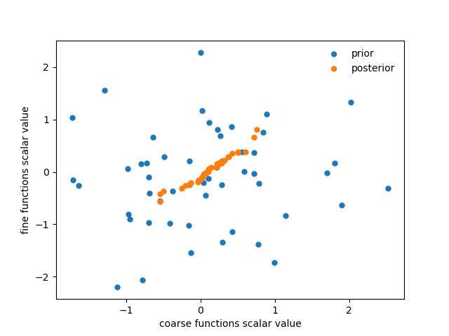

Multilevel Data Assimilation
============================

Overview
--------

In recent years, the multilevel Monte Carlo method (Giles, 2008) has gained in popularity at
it's ability to efficiently estimate statistics of discretized random variables, whether they be
scalar or even solutions to random Partial Differential Equations. We are interested in the
latter case where one also wants to assimilate data into the ensemble forecast of statistics
of a finite-element discretization of a PDE, using multilevel Monte Carlo for efficiency. The
methodology for combining the aforementioned Ensemble Transform Particle Filter (ETPF) with
multilevel Monte Carlo is outlined in Gregory et al. (2015, 2016). Multilevel Monte Carlo works
by combining a hierarchy of separate ensemble forecasts; larger ensembles of less accurate
discretizations and smaller ensembles of more accurate ensembles. As the computational cost is
traded off in such a way, the overall computational cost of the combination of them will be
smaller than the standard Monte Carlo estimate with the same accuracy.

The multilevel ETPF works in a very similar way, only with filter estimates rather than standard
Monte Carlo estimates. Once again we concentrate on using hierarchies of meshes, :math:`M_{l}`, where

.. math:: M_{L} \subset M_{L-1} \subset \dots M_{l} \subset \dots M_{0},

and let ensembles of functions :math:`f_{l,t_{k}}`, representing the solution to a given
system of PDEs with a random component at time :math:`t_{k}`, be on a function space :math:`V_{l}` that
exists on the mesh :math:`M_{l}`. Then the multilevel ETPF estimate to the first moment of the conditional
distribution of the function :math:`f_{L,t_{k}}` on the finest mesh given partial observations of a reference
function, :math:`Y_{t_{1}},...,Y_{t_{k}}`, be given by

.. math:: \mathbb{E}\left(f_{L,t_{k}}^{i}|Y_{t_{1}},...,Y_{t_{k}}\right) \approx \left(\sum_{i=1}^{N_{0}}f_{0,t_{k}}^{i}w_{0,t_{k}}^{i}\right) + \sum_{l=1}^{L}\left(\sum_{i=1}^{N_{l}}f_{l,t_{k}}^{i}w_{l,t_{k}}^{i}-\hat{f}_{l-1,t_{k}}^{i}\hat{w}_{l-1,t_{k}}^{i}\right),

where :math:`i` denotes a sample of the function in question. Also note here that the function
:math:`\hat{f}_{l-1,t_{k}} \sim f_{l-1,t_{k}}` but the samples of it are just independent from
the samples of :math:`f_{l-1,t_{k}}`. The importance weights for these samples :math:`\hat{f}_{l-1,t_{k}}^{i}`
are given by :math:`\hat{w}_{l-1,t_{k}}^{i}` respectively.

For each independent estimate in the equation above, one can build the coarse and fine ensembles and define prior
weights (if all ensemble members in both ensembles are sampled i.i.d from the initial distribution) via the
following commands:

.. code::
    
    ensemble_coarse = []
    ensemble_fine = []
    for i in range(N):
        fc = Function(Vc)
        ff = Function(Vf)
        ensemble_coarse.append(fc)
        ensemble_fine.append(ff)
    
    weights_coarse = []
    weights_fine = []
    for i in range(N):
        wc = Function(Vc).assign(1.0 / N)
        wf = Function(Vf).assign(1.0 / N)
        weights_coarse.append(wc)
        weights_fine.append(wf)

Here, `Vc` and `Vf` are the coarse and fine function spaces in each independent estimate in the equation above.

Then one can simply use these ensemble functions as the solutions to the system that one wishes to forecast.
More details on how to implement this method can be found in Gregory et al. (2015, 2016) however
we will concentrate on how to carry out the key part of this method, the resampling / transformation.
A vital ingredient to the multilevel Monte Carlo framework is being able to keep each pair of samples
in each independent estimate in the formula above correlated throughout time and space. This requires
the same random component (e.g. initial condition) being used amongst pairs of samples but also
that they get transformed / resampled in a way that keeps them correlated. In the multilevel
ETPF, this is achieved using a coupling scheme. This coupling scheme also transforms each ensemble from a
weighted one to an evenly weighted one, whilst preserving the ensemble mean like in the standard ETPF.

Coupling
--------

This coupling scheme can be implemented in FADE very simply. In each independent estimate in the equation above
one can update the weights of both the coarse and fine at each new assimilation step using the standard
weight update method. One will note that each level of the mesh hierarchy has two ensembles of functions
built on it, and it is important that both of the estimates from these two ensembles use the same radius of
localisation for consistency of the overall multilevel estimator. This is not to say that the coarse and fine
ensembles can't use different radii in each individual independent estimate. Therefore,
in the case of one independent estimator, we will use an arbitrary `r_loc_c` for the coarse weight localisation
and `r_loc_f` for the fine weight localisation.

.. code::
    
    weights_coarse = weight_update(ensemble_coarse, weights_coarse,
                                   observation_operator_coarse, r_loc_c, r_loc_f)
    weights_fine = weight_update(ensemble_fine, weights_fine,
                                 observation_operator_fine, r_loc_c, r_loc_f)

Here, each level has to have a separate `observation_operator` initialized and updated. Then to carry out the ensemble
transform and coupling stage we use the single command:

.. code::
    
    ensemble_coarse, ensemble_fine = seamless_coupling_update(ensemble_coarse, ensemble_fine,
                                                              weights_coarse, weights_fine,
                                                              r_loc_c, r_loc_f)

Example
-------

As an example, consider two ensembles of functions, :math:`f_{l-1}^{i} \in V_{l-1}` and :math:`f_{l}^{i} \in V_{l}`,
:math:`i=1,...,50`, and thus one ensemble lives on a coarse mesh in a hierarchy whilst the other lives on the mesh one
level above it. Suppose that each function takes a single value across the whole domain, randomly drawn from the
standard normal distribution. Each pair of functions in either ensemble are drawn independent samples from one another.
Each ensemble of functions are both given posterior importance weight functions
by conditioning them in the above manner around a single observation. Localisation is implemented such that all importance weights have the same value across the whole domain. Then the `seamless_coupling_update`
command is used to transform the ensembles to generate evenly weighted ensembles that are positively coupled.
:ref:`coupling_fig` shows the scalar value taken across the whole domain by the functions in the original
ensembles (independent) and the transformed / coupled ensembles (positively correlated).

.. _coupling_fig:

   Figure 1
